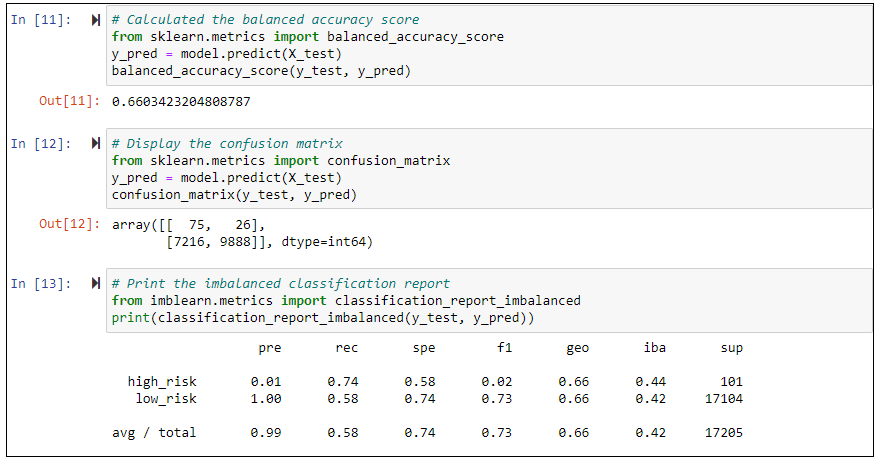
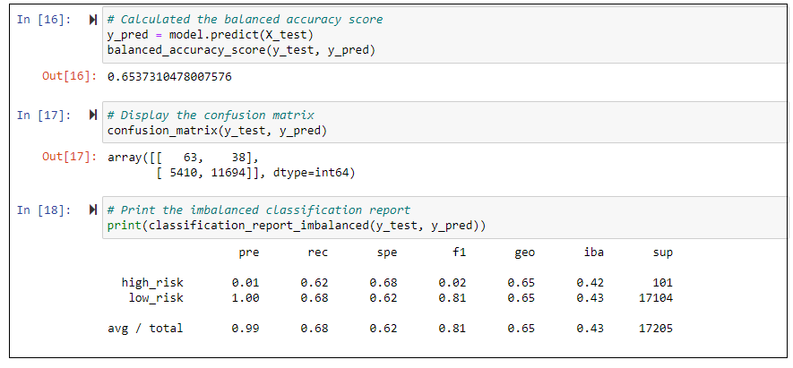
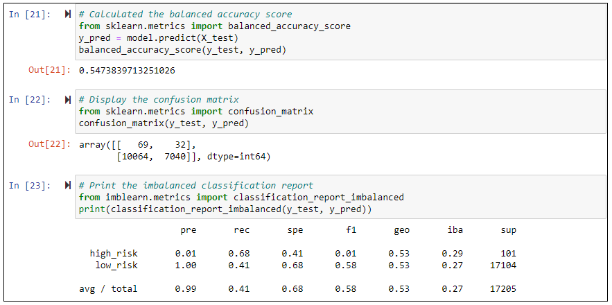
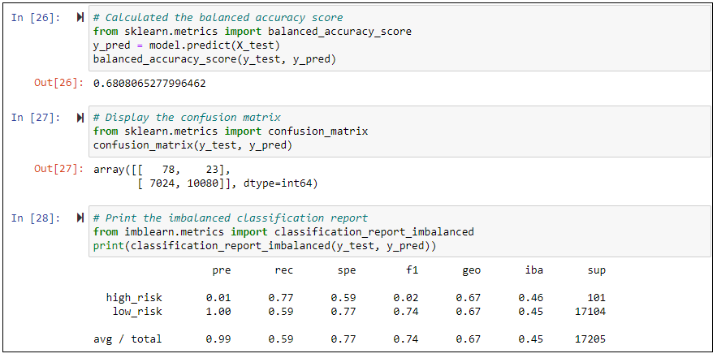
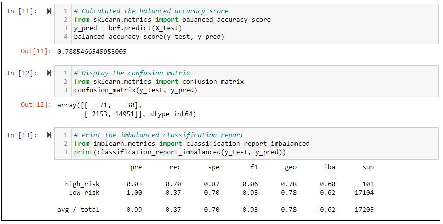
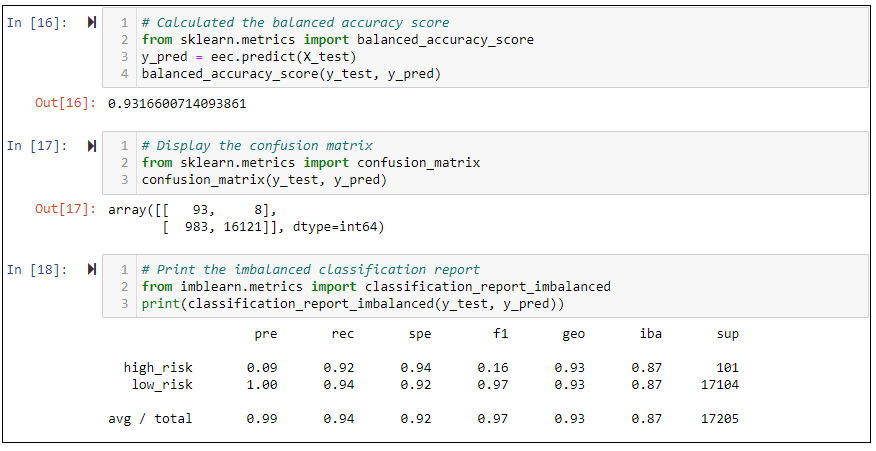

# Credit Risk Analysis

## Overview
***Fast Lending***, a peer to peer lending services company wants to use machine learning to predict credit risk. Management believes that this will provide a quicker and more reliable loan experience. It also believes that machine learning will lead to more accurate identification of good candidates for loans which will lead to lower default rates. The company wants me to assist the lead Data Scientist, Jill, in implementing this plan. In my role, I will build and evaluate several machine learning models or algorithms to predict credit risk, I will use techniques such as resampling and boosting to make the most of my models and my data. Once I've designed and implemented these algorithms, I'll evaluate their performance and see how well my models predict data. To accomplish my task, I will dive headlong into machine learning algorithms, statistics, and data processing techniques.

## Purpose of this Analysis
In this analysis, I have to apply machine learning to solve a real-world challenge: credit card risk. Credit risk is an inherently unbalanced classification problem, as good loans easily outnumber risky loans. Therefore, I’ll need to employ different techniques to train and evaluate models with unbalanced classes.

## Resources
* Software/Tools: Google Colab, Visual Studio Code (v1.49.2), Jupyter Notebook
* Language(s): Python
* Libraries: Pandas, Numpy, scikit-learn, imbalanced-learn
* Data Source(s): https://github.com/Govind-Patwal/Credit_Risk_Analysis/blob/main/LoanStats_2019Q1.csv

## Results

1. **Naive Random Oversampling** (Image below)
    * Precision: High Risk = 0.01; Low Risk = 1.00
    * Recall: High Risk = 0.71; Low Risk = 0.60
    * Balanced Accuracy Score = 0.66
    * Accuracy score is very less

    

2. **SMOTE Oversampling** (Image below)
    * Precision: High Risk = 0.01; Low Risk = 1.00
    * Recall: High Risk = 0.61; Low Risk = 0.67
    * Balanced Accuracy Score = 0.64
    * Accuracy score is again very less

    

3. **Cluster Centroids Undersampling** (Image below)
    * Precision: High Risk = 0.01; Low Risk = 1.00
    * Recall: High Risk = 0.66; Low Risk = 0.43
    * Balanced Accuracy Score = 0.54
    * Accuracy score went down as compared to the last algorithm

    

4. **SMOTEENN (Combination of Over and Undersampling)** (Image below)
    * Precision: High Risk = 0.01; Low Risk = 1.00
    * Recall: High Risk = 0.77; Low Risk = 0.54
    * Balanced Accuracy Score = 0.66
    * Accuracy score has imporved over last algorithm but still low

    

5. **Balanced Random Forest Classifier** (Image below)
    * Precision: High Risk = 0.03; Low Risk = 1.00
    * Recall: High Risk = 0.70; Low Risk = 0.87
    * Balanced Accuracy Score = 0.79
    * Accuracy Score is reasonaly good, much better than the 4 algorithms above

    

6. **Easy Ensemble AdaBoost Classifier**
    * Precision: High Risk = 0.09; Low Risk = 1.00
    * Recall: High Risk = 0.92; Low Risk = 0.94
    * Balanced Accuracy Score = 0.93
    * Accuracy score is very good - the best amongst all 6 algorithms

    

## Summary
Looking at the 6 algorithms, we can observe that the 2 Ensemble performed way better than the Oversampling/Undersampling/Combination algorithms. 

Furthermore, of the 2 Ensemble algorithms, the AdaBoost clearly stood out with 93% Accuracy. It also has the highest high-risk and low-risk recall scores. Finally, another very important place where it does much better as compared to others is the high-risk precision score - in this score it is 3x that of the algorith with the seconds highest precesion, and 9x that of the majority of the algorithms - this means it is 3-9 times more likely to spot high-risk loans, that can have serious consequences for any lender. This is therfore our best bet.